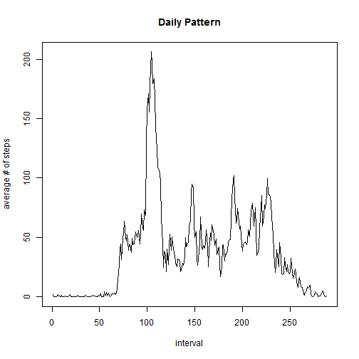
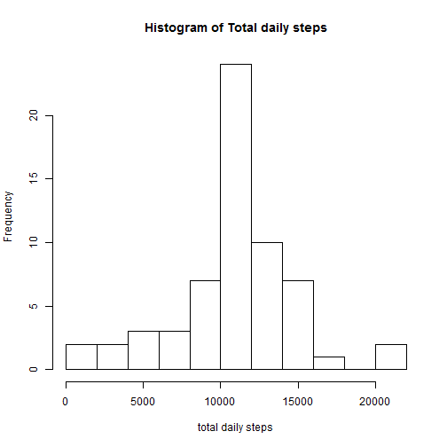
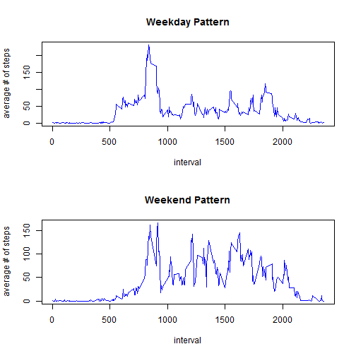

 Week 1 Assignment
===================


### reading the data  

```r
data <- read.csv("activity.csv",header=TRUE)  
```
  
### calculating the mean  

```r
nandata <- data  
data <- data[!is.na(data$steps),]  
totalsteps <- sum(data$steps)    
```
  

### Making a histogram of the # of steps taken each day

```r
dailytotal<-aggregate(steps ~ date, FUN=sum,data=data)
hist(dailytotal[,2], breaks = 10,main="Histogram of Total daily steps",xlab = "total daily steps")
```


```r
summary(dailytotal$steps)[3:4] 
```

```
## Median   Mean 
##  10760  10770
```

### reporting the daily activity pattern

```r
dailypattern <- tapply(data$steps,data$interval,FUN=mean)
plot(dailypattern,main="Daily Pattern",xlab="interval",ylab="average # of steps",type="l")  
```




### Reporting the number of missing values

```r
N<-sum(is.na(nandata$steps))
N
```

```
## [1] 2304
```

### filling NAs  
for each missing value I put the average of that interval  

```r
data<-nandata
for (i in 1:dim(data)[1]){
  if (is.na(data[i,1])){
    int<-data[i,3]
    data[i,1]<- dailypattern[as.character(int)]
  }
}
```


### seeing the histogram and summary of the new dataset  

```r
newdailytotal<-aggregate(steps ~ date, FUN=sum,data=data)
hist(newdailytotal[,2], breaks = 10,main="Histogram of Total daily steps",xlab = "total daily steps")
```



```r
summary(newdailytotal$steps)[3:4] 
```

```
## Median   Mean 
##  10770  10770
```

It is not surprising that mean has not changed, as we filled every missing value with the average, and it appears  
that if the observation was missing, it was missing for the entire day, thus mean is unchanged. Median happens to coinside.  
For the histogram, we don't observe the bars to be different, but if we look at the frequencies, we'll see they've  
increased as expected, since we have more days under observation now

### separating out the weekdays from the weekends

```r
data$day<-weekdays(as.Date(as.character(data$date),"%Y-%m-%d"))
data$day<-(data$day=="Sunday" | data$day=="Saturday")  

weekendpattern <- aggregate(steps ~ interval, FUN=mean,data=data[data$day,])
weekdaypattern <- aggregate(steps ~ interval, FUN=mean,data=data[!data$day,])
par(mfrow=c(2,1))
plot(weekdaypattern,main="Weekday Pattern",xlab="interval",ylab="average # of steps",type="l",col="Blue") 
plot(weekendpattern,main="Weekend Pattern",xlab="interval",ylab="average # of steps",type="l",col="Blue")  
```



one explanation for the difference could be that people wake up later during the weekend, thus we see the activity  
to peak up later in the day. Also we see more movement on weekends as people supposedly work during the weekdays
